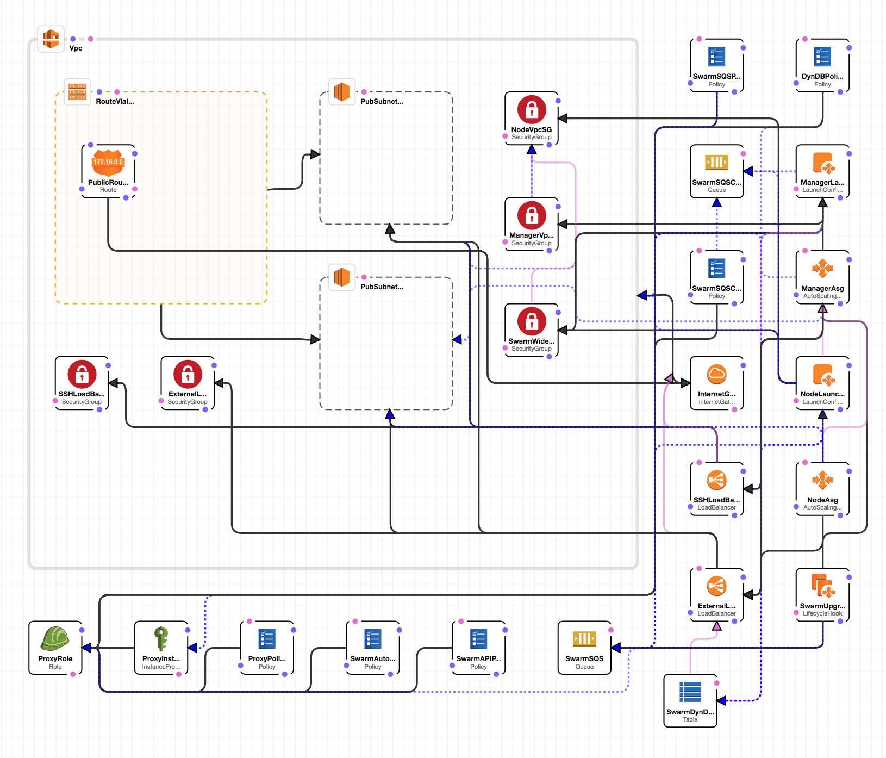

# Docker for AWS

## Cloudformation

Create Stack from CLI:

```
export AWS_DEFAULT_PROFILE="personal"
export AWS_DEFAULT_REGION=ap-southeast-1
aws cloudformation create-stack \ 
  --stack-name dockerforaws \ 
  --template-url https://docker-for-aws.s3.amazonaws.com/aws/beta/aws-v1.12.2-beta9.json \
  --parameters ParameterKey=InstanceType,ParameterValue=t2.micro \ 
               ParameterKey=ManagerInstanceType,ParameterValue=t2.micro \ 
               ParameterKey=ClusterSize,ParameterValue=3 \ 
               ParameterKey=ManagerSize,ParameterValue=1 \
               ParameterKey=KeyName,ParameterValue=so0k-key \
  --capabilities CAPABILITY_IAM
```
**Note**: If you want to demo leader election, use more than 1 master!

**Note**: AWS Access key needs to be able to:

1. Access the template from S3
2. CloudWatch access
3. IAM access (to create roles and policies, ...)
4. EC2 access (to create scaling groups, load balancers, ...)
5. DynamoDB access
6. SQS access
7. CloudFormation access

Monitor progress:
```
while true; do aws cloudformation describe-stacks --stack-name dockerforaws --query "Stacks[].StackStatus" --output=text; sleep 1; done
```

Troubleshoot:
```
aws cloudformation describe-stack-events --stack-name dockerforaws --query 'StackEvents[].ResourceStatusReason'
```

If required to re-create, remove first:
```
aws cloudformation delete-stack --stack-name dockerforaws
```

When completed (10-15min), fetch cloudformation template outputs
```
aws cloudformation describe-stacks --stack-name=dockerforaws --query 'Stacks[].Outputs
export DEFAULT_DNS_TARGET=`aws cloudformation describe-stacks --stack-name=dockerforaws --query 'Stacks[].Outputs[?OutputKey==\`DefaultDNSTarget\`].OutputValue' --output=text`
```
Notice there are 2 outputs, the endpoints for ELB and SSH

Set up local port to tunnel to master:
```
ssh -NL localhost:2374:/var/run/docker.sock  docker@$DEFAULT_DNS_TARGET &
export DOCKER_HOST=localhost:2374
docker node ls
docker info
```

## Docker For AWS Docs

* [Overview of Docker For AWS](https://beta.docker.com/docs/aws/)
* [Deploying applications](https://beta.docker.com/docs/deploy/)

Diagram:


(To get this diagram, while in "Create Stack", after entering template, click on **Designer**)

The CloudFormation Template will:

1. Create VPC, subnets & Security groups
2. Create 2 Auto Scaling Groups (managers & workers) with desired capacity
3. Managers form quorum using RAFT
4. Workers join swarm
5. ELB created to route traffic to services
6. Ready for deployments

**What is purpose of SQS**?

When AWS replaces an instance, the instance can learn of its impending doom and gracefully exit itself from the swarm and manager quorum.
[source](https://forums.docker.com/t/purpose-of-sqs-queues-in-docker-for-aws/19688/2)

## Demos

[Demo from last meetup](https://github.com/so0k/ecs-sample#play-with-docker-service-concept)

### Demo setup:

Run the visualizer as a service:
```
docker service create \
  --name visualiser \
  --mount type=bind,source=/var/run/docker.sock,target=/var/run/docker.sock,readonly=false \
  --constraint node.role==manager \
  -p 3000:3000 \
  -e PORT=3000 \
  -e HOST=$DEFAULT_DNS_TARGET \
  manomarks/visualizer
```

### Exploring Services

```
docker service create --name nginx -p 80:80 nginx
```

```
open http://$DEFAULT_DNS_TARGET
```

```
docker service ls
```

```
docker service inspect --pretty nginx
```

```
docker service ps nginx
```

note: watch visualizer
```
docker service scale nginx=5
```

### Node Management

Listing nodes
```
docker node ls
```
Note: see visualizer - grab one node `HOST_NAME`

Draining Nodes
```
docker node update --availability drain <host_name>
```

Notice visualizer will update, if not - just reload
```
docker node update --availability active <host_name>
```
[Reference](https://github.com/docker/labs/blob/master/swarm-mode/beginner-tutorial/README.md)

Attaching labels to nodes:

```
docker node update --label-add disk=ssd <host_name>
```

Use label in constraints for service:
```
docker service create --name myservice --constraint 'node.labels.disk == ssd' myimage
```

### Service Deployment on Docker For AWS

Simple Sample app
```
docker service create --name city --replicas 5 --publish "8081:80" so0k/randomcity:1.0
```

Demonstrate load balancing
```
while true; do curl -w "\n" $DEFAULT_DNS_TARGET:8081; sleep 1; done
```

Demonstrate rolling update, keep the while loop running...
```
docker service update --image so0k/randomcity:1.1 city
```
[reference](https://github.com/lucj/randomCity)

[reference](https://docs.docker.com/engine/reference/commandline/service_update/)

Notice update in progress
```
docker service inspect city --pretty
```

### Distributed Application Bundles

[Exmaple Voting App](https://github.com/docker/example-voting-app)

First, run full stack locally:
```
git clone git@github.com:docker/example-voting-app
cd example-voting-app
docker-compose up
```

Open locally: vote [here](http://localhost:5000) -  results [here](http://localhost:5001)

At the time of writing, we can already deploy this multi-layer application in a 
production-ready set-up on Docker 1.12 as follows:

* Define [overlay networks](http://blog.nigelpoulton.com/demystifying-docker-overlay-networking/)
to segregate network access of each tier within the Stack
* Define [volumes](http://collabnix.com/archives/2001) for persistent storage
* Add node constraints to control co-location of certain containers
* Create each service attached to the correct network one by one

This all **works** and is production ready **today**!

However, there is also an *experimental* feature which allows you to take an 
existing stack definition (docker-compose.yaml) and convert it into a 
Distributed Application Bundle (DAB). 

There are still some constraints, but it is possible to try this out with the
example voting application with the following changes:

1.  Add `image` fields to each service in compose file
2.  Let compose build all images with the tags we added
    ```
    docker-compose build
    ```
3.  Bundle the application and push all images to the registry with 1 command
    ```
    docker-compose bundle --push
    ```
4.  Due to [a regression](https://github.com/docker/docker/issues/27469) - edit
the dab file and only keep port 80 for results app.
    ```
    vim examplevotingapp.dab
    ```
5.  Deploy the dab file
    ```
    docker deploy examplevotingapp
    ```
Note: get logs via CloudWatch>Logs
6.  Update the services and publish the ports they exposed
    ```
    docker service update --publish-add 30001:80 examplevotingapp_result
    ```

In case step 6 is failing, here's a hack to manually add ports 3000,30001 & 30002 to elb:
```
aws elb create-load-balancer-listeners --load-balancer-name dockerforaws-ELB --listeners "Protocol=HTTP,LoadBalancerPort=3000,InstanceProtocol=HTTP,InstancePort=3000"
aws elb create-load-balancer-listeners --load-balancer-name dockerforaws-ELB --listeners "Protocol=HTTP,LoadBalancerPort=30001,InstanceProtocol=HTTP,InstancePort=30001"
aws elb create-load-balancer-listeners --load-balancer-name dockerforaws-ELB --listeners "Protocol=HTTP,LoadBalancerPort=30002,InstanceProtocol=HTTP,InstancePort=30002"
```

## Release notes:

At October 12, 2016:

* Container logs sent to cloudwatch
* Swarm access with SSH
* port 2375 is closed (use ssh tunnel)
* CloudFormation based installer
* ELB Integration for running public-facing servcies
* Worker sclaing using ASG (desiredstate count)

[source](https://beta.docker.com/docs/aws/release-notes/)

### Todo:

Use ehazlett/docker-demo as demo app..
```
docker service create --name demo --replicas 5 --publish "8080:8080" ehazlett/docker-demo
```
